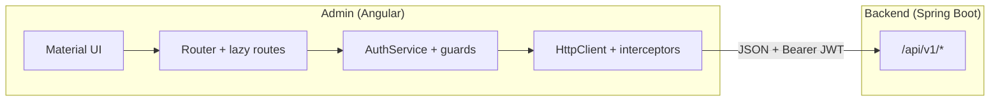
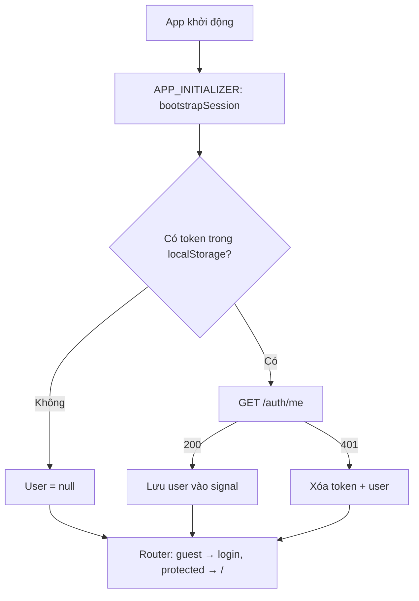
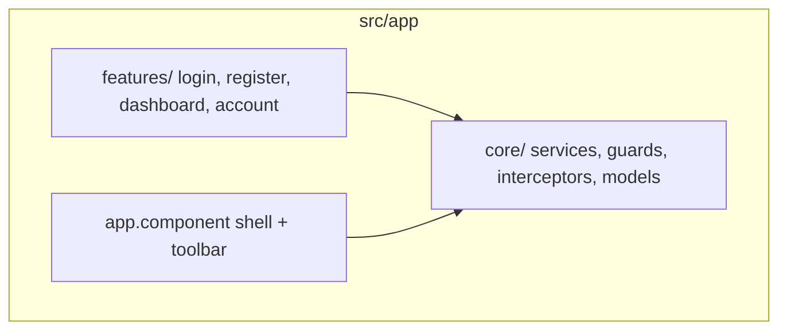

# PickleBall Admin (Frontend)

Ứng dụng **Angular 19** (standalone) + **Angular Material** (theme Azure Blue) dùng làm giao diện quản trị: đăng nhập, đăng ký, bảng điều khiển, quản lý tài khoản.

## Vị trí trong hệ thống



## Luồng phía client (phiên đăng nhập)



## Cấu trúc thư mục (rút gọn)



| Thư mục | Nội dung |
|---------|----------|
| `core/services` | `AuthService`, `AccountService` |
| `core/interceptors` | Gắn header `Authorization`, xử lý 401 |
| `core/guards` | `authGuard`, `guestGuard` |
| `environments` | `environment.development.ts` trỏ API (mặc định `http://localhost:8080`) |

## Công nghệ

| Thành phần | Ghi chú |
|------------|---------|
| Angular | 19, standalone, signals |
| UI | Angular Material, SCSS |
| Build | `ng build` / `ng serve` |

## Chạy local

1. Bật backend tại `http://localhost:8080` (CORS đã mở cho `http://localhost:4200`).

2. Admin:

```bash
cd admin
npm install
npm start
```

Trình duyệt: `http://localhost:4200`.

**Build dev** (dùng `environment.development.ts` qua `fileReplacements`):

```bash
npx ng build --configuration=development
```

**Build production** (API cùng origin: `apiUrl: ''` trong `environment.ts`, thường kèm reverse proxy):

```bash
npx ng build
```

Có thể tạo cấu hình build production riêng với `fileReplacements` trỏ tới `environment` chứa URL API tuyệt đối nếu deploy tách host.

## Route chính

| Đường dẫn | Mô tả | Guard |
|-----------|--------|--------|
| `/login` | Đăng nhập | `guest` |
| `/register` | Đăng ký | `guest` |
| `/` | Bảng điều khiển | `auth` |
| `/account` | Hồ sơ + đổi mật khẩu | `auth` |
| `/users` | Bảng người dùng: lọc, thêm, sửa, vô hiệu hóa (chỉ **ADMIN**) | `auth` + `admin` |
| `/user-notes` | Ghi chú gắn user (mẫu template 1–n với `User`) | `auth` + `admin` |
| `/gallery` | Upload ảnh, lưới xem, xóa; URL công khai từ `publicId` | `auth` + `admin` |
| `/courts` | Danh sách sân: tìm, lọc trạng thái, thêm / sửa / xóa; gán chủ sân theo ID user (tùy chọn) | `auth` + `admin` |
