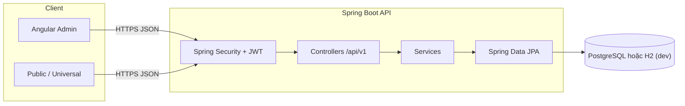
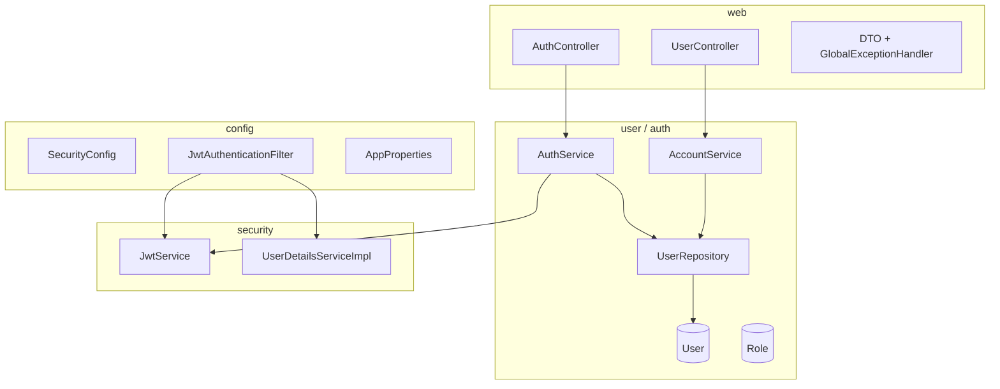

# PickleBall API (Backend)

REST API **Spring Boot 3** cho ứng dụng đặt sân pickleball: **JWT**, **JPA**, schema team (`users`, `roles`, `products`, …).

## Kiến trúc tổng quan



## Cơ sở dữ liệu (Hibernate `ddl-auto`)

Bảng được map bởi entity JPA (`ddl-auto`: `update` trên `dev` / `pgsql`). Danh sách chính:

| Bảng | Ghi chú |
|------|---------|
| `users` | `username`, `password`, `email`, tên, `user_type` (ADMIN/OWNER/PLAYER), `level`, … |
| `roles` | Tên vai trò (`ADMIN`, `OWNER`, `PLAYER`), seed khi khởi động |
| `user_roles` | N-N user ↔ role (đồng bộ với `user_type`) |
| `products` | Địa điểm cho thuê: tiêu đề, mô tả, vị trí, lat/lng, rate, `owner_id`, `status` |
| `product_images`, `product_utilities`, `product_utility_mappings`, `product_prices` | Ảnh, tiện ích, giá theo khung giờ |
| `time_slots`, `slot_holds`, `orders`, `payments` | Lịch, giữ chỗ, đơn, thanh toán |
| `product_rates` | Đánh giá |
| `matches`, `match_players` | Ghép trận |
| `notifications` | Thông báo |

Nhiều bảng **chưa có REST** riêng — chỉ tạo schema để mở rộng sau.

Chi tiết schema (bảng/cột khớp code): `docs/DATABASE_DESIGN.md`.

### Index

Các trường thường dùng để lọc / khóa ngoại đã khai báo `@Index` trên `@Table` (ví dụ `orders.user_id`, `orders.product_id`, `time_slots.product_id`, `products.owner_id`, `users.user_type`, …). Hibernate tạo index khi schema được cập nhật.

**Gợi ý production:** chuyển dần sang **Flyway** (hoặc Liquibase), đặt `ddl-auto: validate`, và bổ sung ràng buộc nghiệp vụ (không trùng khung giờ trên cùng `product`, …) khi có API đặt chỗ thật.

## Luồng xác thực (JWT)

```mermaid
sequenceDiagram
  participant C as Client
  participant API as API
  participant J as JwtAuthenticationFilter

  C->>API: POST /api/v1/auth/login
  API->>C: 200 + accessToken (Bearer)
  C->>API: GET /api/v1/auth/me (Authorization: Bearer ...)
  API->>J: filter chain
  API->>C: 200 UserResponse

  Note over C,API: Register tương tự login; đăng nhập theo email + password
```

Quyền Spring: `ROLE_ADMIN`, `ROLE_OWNER`, `ROLE_PLAYER` (theo `user_type`).

## Cấu trúc gói (rút gọn)



## Công nghệ

| Thành phần | Phiên bản / ghi chú |
|------------|---------------------|
| Java | 17 |
| Spring Boot | 3.2.x |
| Bảo mật | Spring Security, BCrypt, JWT (jjwt) |
| Dữ liệu | JPA + PostgreSQL (`pgsql`) hoặc H2 (`dev`) |
| Build | Maven |

## Chạy local

**Mặc định:** profile `dev` — H2 in-memory, cổng **8080**.

```bash
cd backend
mvn spring-boot:run
```

**PostgreSQL (Docker, chỉ DB — không build app):** file compose nằm tại `backend/infra/docker-compose.yml`.

Từ thư mục gốc repo:

```bash
docker compose -f backend/infra/docker-compose.yml up -d
```

Hoặc sau `cd backend`:

```bash
docker compose -f infra/docker-compose.yml up -d
```

Mặc định: user / mật khẩu / database `pickerball` trùng `application.yml` (profile `pgsql`). Cổng host **5432**.

Hoặc tự tạo database `pickerball` trên PostgreSQL sẵn có, cấp user/mật khẩu giống `application.yml`, rồi:

```bash
SPRING_PROFILES_ACTIVE=pgsql mvn spring-boot:run
```

Biến môi trường hữu ích: `JWT_SECRET`, `JWT_EXPIRATION_MS`, `CORS_ALLOWED_ORIGINS`, `DATABASE_URL`, `DATABASE_USER`, `DATABASE_PASSWORD`.

**Profile `dev`:** nếu chưa có **ADMIN** hoạt động, app tạo user mặc định: **username** `admin`, email `admin@pickerball.local`, mật khẩu `Admin12345` (đổi ngay trên môi trường thật).

## API (prefix `/api/v1`)

| Phương thức | Đường dẫn | Auth |
|-------------|-----------|------|
| POST | `/auth/register` | Không — body: `username`, `email`, `password`, `firstName`, `lastName`, … |
| POST | `/auth/login` | Không — email + password |
| GET | `/public/products` | Không (chỉ `status=active`, phân trang `q`, `page`, `size`, `sort`) |
| GET | `/public/products/{id}` | Không (chỉ khi còn active; không thì 404) |
| GET | `/auth/me` | Bearer JWT |
| PUT | `/users/me` | Bearer JWT |
| PUT | `/users/me/password` | Bearer JWT |

### Quản lý người dùng (role **ADMIN**)

Prefix `/api/v1/admin/users`, JWT với `ROLE_ADMIN`.

| Phương thức | Đường dẫn | Mô tả |
|-------------|-----------|--------|
| GET | `?q=&userType=&active=&page=&size=&sort=` | Danh sách; `userType`: `ADMIN` \| `OWNER` \| `PLAYER` |
| GET | `/{id}` | Chi tiết |
| POST | / | Tạo (`username`, `email`, `password`, `userType`, …) |
| PUT | `/{id}` | Cập nhật; có thể `newPassword` |
| DELETE | `/{id}` | Vô hiệu hóa (soft) |

### Sản phẩm / địa điểm (bảng `products`)

Prefix `/api/v1/admin/products`, `ROLE_ADMIN`.

| Phương thức | Đường dẫn | Mô tả |
|-------------|-----------|--------|
| GET | `?q=&status=&ownerUserId=&page=&size=&sort=` | Danh sách; `status` thường `active` / `inactive` |
| GET | `/{id}` | Chi tiết |
| POST | / | Tạo (`title`, `description`, `location`, lat/lng, `rate`, …) |
| PUT | `/{id}` | Sửa; bỏ chủ: `clearOwner: true` |
| DELETE | `/{id}` | Xóa bản ghi |

## Kiểm thử

```bash
mvn test
```
